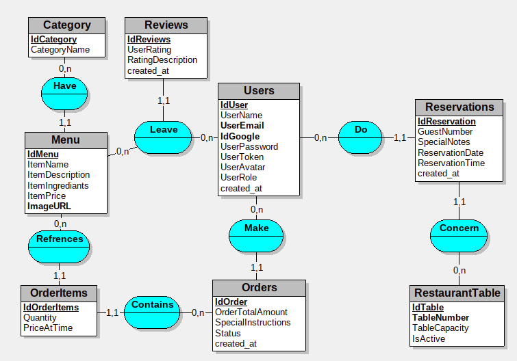
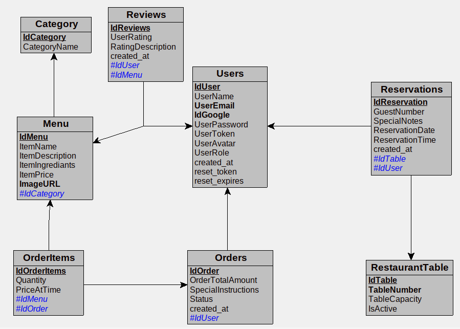

# SmartBite — Application Web pour Restaurant

**Préparé par :** Nadine Jdid, Marianne Dagher, Elichaa Saleh Mhanna

---

## Présentation du projet

SmartBite est née d'un constat simple : beaucoup de restaurants offrent une excellente expérience en salle, mais peinent à exister en ligne. Pas de menu accessible facilement, des réservations qui se font encore par téléphone, des commandes perdues dans les échanges WhatsApp… SmartBite est là pour régler tout ça.

L'application donne au restaurant une présence digitale complète — un endroit où les clients peuvent consulter le menu, réserver une table, passer commande et interagir avec un assistant IA, le tout sans friction.

---

## Ce que le projet résout

- Aucune vitrine en ligne pour présenter les plats
- Difficulté pour les clients de commander en ligne
- Perte de visibilité et de clients potentiels
- Communication désorganisée avec la clientèle
- Absence de gestion des commandes en temps réel
- Suivi manuel des réservations
- Pas de tableau de bord administrateur centralisé

---

## Fonctionnalités principales

### Côté visiteur (sans connexion)

- Parcourir le menu par catégories et rechercher des plats
- Ajouter, modifier ou retirer des articles du panier
- Consulter les avis laissés par les clients
- Discuter avec l'assistant IA intégré (recommandations, allergènes, descriptions)

### Côté utilisateur connecté

- Passer une commande depuis le menu ou le panier
- Recevoir une confirmation par e-mail après commande
- Recommander une commande passée (reorder)
- Réserver une table en choisissant date, heure et nombre de convives
- Modifier ou annuler une réservation depuis le profil
- Laisser un avis (note et commentaire) sur un plat
- Consulter l'historique des commandes, réservations et avis
- Modifier son profil (nom, mot de passe, avatar)
- Supprimer son compte

### Authentification

- Inscription et connexion par e-mail / mot de passe
- Connexion via compte Google (OAuth 2.0)
- Option « Se souvenir de moi » (cookie, 30 jours)
- Mot de passe oublié avec envoi d'un lien de réinitialisation par e-mail
- Déconnexion sécurisée

### Tableau de bord administrateur

- Vue d'ensemble avec statistiques (commandes en attente, utilisateurs actifs, etc.)
- Gestion du menu (ajout, modification, suppression de plats et catégories)
- Gestion des commandes (statuts, modification, suppression)
- Gestion des réservations
- Gestion des tables du restaurant (numéro, capacité, activation)
- Gestion des avis
- Gestion des utilisateurs (rôles, modification, suppression)

### Assistant conversationnel (IA)

Un agent conversationnel alimenté par **Google Gemini** est intégré à la page d'accueil. Il peut :

- Répondre aux questions sur les plats et leurs ingrédients
- Proposer des recommandations selon les préférences
- Alerter sur les allergènes mentionnés dans le menu
- Orienter l'utilisateur vers les autres sections du site

---

## Technologies utilisées

| Technologie | Rôle |
|-------------|------|
| HTML / CSS / JavaScript | Interface utilisateur, interactions dynamiques |
| Bootstrap 5 | Mise en page responsive et composants UI |
| Font Awesome | Icônes |
| PHP 8+ | Logique serveur, API REST, sessions |
| MySQL / MariaDB | Stockage des données |
| PHPMailer | Envoi d'e-mails (réinitialisation, confirmations) |
| Google OAuth 2.0 | Connexion via compte Google |
| Google Gemini API | Assistant conversationnel du menu |
| Composer | Gestion des dépendances PHP |

---

## Pages de l'application

| Page | Description |
|------|-------------|
| `index.php` | Accueil — menu complet, panier et assistant IA |
| `search-menu.php` | Recherche et filtrage des plats du menu |
| `cart.php` | Panier — gestion des articles avant commande |
| `purchase.php` | Récapitulatif et validation de la commande |
| `reservation.html` | Formulaire de réservation de table |
| `review.php` | Consulter et laisser un avis sur un plat |
| `signin.html` / `signup.html` | Connexion et inscription |
| `forgot-password.html` | Demande de réinitialisation du mot de passe |
| `reset-password.php` | Définition d'un nouveau mot de passe |
| `profile.html` | Espace personnel — commandes, réservations, avis, profil |
| `dashboard.html` | Tableau de bord administrateur |
| `google-auth.php` | Callback OAuth pour la connexion Google |

---

## Rôles et droits

| Rôle | Permissions |
|------|---------------|
| Visiteur | Consulter le site, parcourir le menu, gérer le panier, utiliser le chatbot |
| Utilisateur | Tout ce que fait le visiteur, plus : commandes, réservations, avis, profil |
| Administrateur | Accès complet au tableau de bord et à la gestion de la base de données |

---

## Structure du projet

```
SmartBite/
├── .env                              # Clé API Gemini
├── Frontend/
│   ├── index.php
│   ├── search-menu.php
│   ├── cart.php
│   ├── purchase.php
│   ├── reservation.html
│   ├── review.php
│   ├── signup.html
│   ├── signin.html
│   ├── forgot-password.html
│   ├── reset-password.php
│   ├── profile.html
│   ├── dashboard.html
│   ├── google-auth.php
│   │
│   ├── css/
│   │   ├── main.css
│   │   ├── auth.css
│   │   ├── index.css
│   │   ├── cart.css
│   │   ├── purchase.css
│   │   ├── reservation.css
│   │   ├── review.css
│   │   ├── chatbot.css
│   │   ├── dashboard.css
│   │   └── profile.css
│   │
│   ├── js/
│   │   ├── auth.js
│   │   ├── auth_navbar.js
│   │   ├── chatbot.js
│   │   ├── dashboard.js
│   │   ├── profile.js
│   │   ├── reservation.js
│   │   └── review.js
│   │
│   └── img/
│       ├── menu-img/
│       │    ├── alfredo pasta.webp
│       │    ├── BBQ bur.webp
│       │    ├── Bolognese pasta.avif
│       │    ├── carbonara pasta.webp
│       │    ├── cheese pizza.jpg
│       │    ├── chicken bur.webp
│       │    ├── chicken ceaser salad.jpg
│       │    ├── chocolate cake.avif
│       │    ├── fish bur.webp
│       │    ├── greek salad.jpg
│       │    ├── hawaiin pizza.webp
│       │    ├──pesto pasta.avif
│       │    ├── soda.jpg
│       │    ├──strawberry smoothie.jpg
│       │    ├── swiss roll.avif
│       │    ├── taco salad.webp
│       │    ├── tiramisu.jpg
│       │    ├──tuna salad.jpg
│       │    ├── veggie piza.jpeg
│       │    └── watermelon smoothie.jpg
│       │
│       ├── MCD_SmartBite.png
│       ├── MLD_SmartBite.png
│       ├── google.png
│       └── profile.jpg
│
├── Backend/
│   ├── api/
│   │   ├── auth/                     # Connexion, inscription, déconnexion, mot de passe
│   │   │   ├── forgot-password.php
│   │   │   ├── logout.php
│   │   │   ├── session_check.php
│   │   │   ├── signin.php
│   │   │   └── signup.php
│   │   │
│   │   ├── cart/                     # Gestion du panier
│   │   │   └── cart-function.php
│   │   │
│   │   ├── chatbot/                  # Proxy vers l'API Gemini
│   │   │   └── chatbot_proxy.php
│   │   │
│   │   ├── dashboard/                # Endpoints du tableau de bord admin
│   │   │   ├── dashboard_actions.php
│   │   │   ├── fetch_all_orders.php
│   │   │   ├── fetch_all_reservations.php
│   │   │   ├── fetch_all_tables.php
│   │   │   ├── fetch_all_users.php
│   │   │   ├── fetch_Menu_Items.php
│   │   │   └── fetch_reviews.php
│   │   │
│   │   ├── menu/                     # Affichage et catégories du menu
│   │   │   ├── get_categories.php
│   │   │   └── index-function.php
│   │   │
│   │   ├── profile/                  # Profil, commandes, réservations, avis
│   │   │   ├── delete_user_review.php
│   │   │   ├── fetch_user_orders.php
│   │   │   ├── feych_user_reservations.php
│   │   │   ├── fetch_user_reviews.php
│   │   │   ├── get_profile.php
│   │   │   ├── profile_receipt_mails.php
│   │   │   ├── receipt_mail_worker.php
│   │   │   ├── reorder_order.php
│   │   │   ├── reservation_actions.php
│   │   │   ├── reservation_helpers.php
│   │   │   ├── update_profile.php
│   │   │   └── upload_profile_avatar.php
│   │   │
│   │   ├── purchase/                 # Validation et envoi des commandes
│   │   │   ├── purchase-function.php
│   │   │   └── send-order.php
│   │   │
│   │   ├── reservation/              # Création de réservations
│   │   │   └── reservation.php
│   │   │
│   │   └── review/                   # Soumission et consultation des avis
│   │       ├── get_menu.php
│   │       ├── get_reviews.php
│   │       └── submit_review.php
│   │   
│   ├── config/
│   │   ├── connection.php            # Connexion MySQL
│   │   ├── secrets.php               # Identifiants Google OAuth et SMTP
│   │   ├── mail_helper.php           # Envoi d'e-mails via PHPMailer
│   │   └── check_remember.php        # Gestion du cookie « Se souvenir de moi »
│   │
│   ├── models/
│   │   ├── DashboardModel.php
│   │   └── ProfileModel.php
│   │
│   ├── Database/
│   │   └── smartbite.sql
│   │
│   ├── uploads/
│   │   └── avatars/                  # Photos de profil uploadées
│   │
│   ├── composer.json
│   └── vendor/                       # Dépendances Composer (non versionné)
│
└── README.md
```

---

## Base de données

La base MySQL `smartbite` centralise toutes les données du restaurant.

**Tables principales :**

| Table | Contenu |
|-------|---------|
| `users` | Comptes utilisateurs (e-mail, mot de passe hashé, rôle, avatar, Google ID) |
| `category` | Catégories du menu |
| `menu` | Plats (nom, description, ingrédients, prix, image) |
| `orders` / `orderitems` | Commandes et leurs lignes |
| `reservations` | Réservations de tables |
| `restauranttable` | Tables du restaurant (numéro, capacité, statut) |
| `reviews` | Avis clients sur les plats |

**Modèle conceptuel de données :**




**Modèle logique de données :**



---

## Installation en local

### Prérequis

- Un serveur local avec **Apache** et **MySQL** : [XAMPP](https://www.apachefriends.org/), [WAMP](https://www.wampserver.com/) ou [MAMP](https://www.mamp.info/)
- **PHP 8.0+** avec l'extension `mysqli`
- **Composer** ([getcomposer.org](https://getcomposer.org/))
- Un navigateur moderne (Chrome, Firefox, Edge…)

### Étapes

**1. Cloner la repo**

```bash
git clone https://github.com/Emberizaelysee/SmartBite.git
cd SmartBite
```

**2. Placer le projet dans le répertoire web du serveur local**

- XAMPP : `htdocs/`
- WAMP : `www/`
- MAMP : `htdocs/`

**3. Installer les dépendances PHP**

```bash
cd Backend
composer install
```

**4. Configurer la base de données**

- Démarrer Apache et MySQL depuis l'interface du serveur local
- Ouvrir phpMyAdmin : `http://localhost/phpmyadmin`
- Créer une base de données nommée `smartbite`
- Importer le fichier `Backend/Database/smartbite.sql`

**5. Configurer la connexion à la base de données**

Vérifier les paramètres dans `Backend/config/connection.php` (par défaut : `localhost`, utilisateur `root`, mot de passe vide).

**6. Configurer les secrets**

Créer le fichier `Backend/config/secrets.php` avec vos identifiants :

```php
<?php
define('MAIL_USER', 'votre-email@gmail.com');
define('MAIL_PASS', 'votre-mot-de-passe-application');
define('GOOGLE_CLIENT_ID', 'votre-client-id.apps.googleusercontent.com');
define('GOOGLE_CLIENT_SECRET', 'votre-client-secret');
define('GOOGLE_REDIRECT_URI', 'http://localhost/SmartBite/Frontend/google-auth.php');
?>
```

> **Note :** Pour Gmail, utilisez un [mot de passe d'application](https://myaccount.google.com/apppasswords) et non votre mot de passe principal.

**7. Configurer l'assistant IA (chatbot)**

Créer un fichier `.env` à la racine du projet :

```bash
GEMINI_API_KEY="VOTRE_CLE_API_GEMINI"
```

Obtenir une clé sur [Google AI Studio](https://aistudio.google.com/apikey).

**8. Accéder à l'application**

Ouvrir dans le navigateur :

```
http://localhost/SmartBite/Frontend/index.php
```

---

## Authentification — détails techniques

- Les mots de passe sont hashés avec `password_hash()` / `password_verify()` (jamais stockés en clair)
- La connexion Google utilise OAuth 2.0 : le backend crée ou récupère le compte via l'e-mail Google, puis ouvre une session PHP
- Les sessions sont gérées avec `$_SESSION` et détruites proprement à la déconnexion
- L'option « Se souvenir de moi » utilise un token stocké en cookie HttpOnly (durée : 30 jours)

---

## Envoi d'e-mails

L'application envoie des e-mails automatiques via PHPMailer (SMTP Gmail) dans les cas suivants :

- Réinitialisation du mot de passe
- Confirmation de commande
- Confirmation de recommande (reorder)
- Confirmation, modification ou annulation de réservation

---

## Lien de la Repository

[https://github.com/Emberizaelysee/SmartBite](https://github.com/Emberizaelysee/SmartBite)
